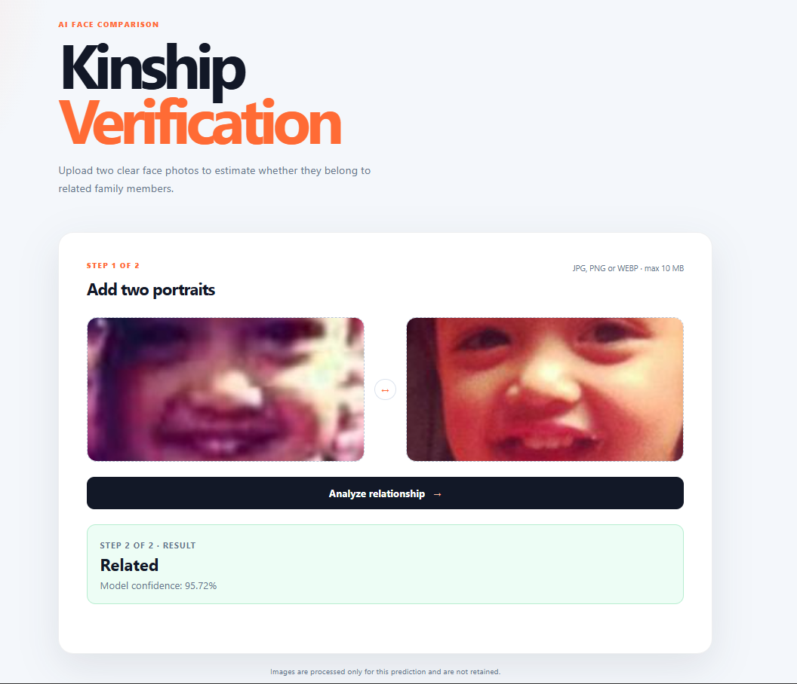

# 👨‍👩‍👧 Kinship Verification using Siamese Neural Network

A Deep Learning project that predicts whether two face images belong to biological family members using a **Siamese Neural Network** built with **PyTorch** and deployed as a **FastAPI web application** with a modern HTML, CSS, and JavaScript frontend.

---

## 📌 Overview

Kinship Verification is a binary image similarity problem where a model determines whether two face images belong to related family members.

This project explores multiple Siamese Network training strategies and provides an end-to-end web application for real-time inference.

> **Note**
>
> For detailed information about the dataset, problem statement, preprocessing, model architecture, training pipeline, and implementation details, please refer to **GUIDE.md**.

---

## 🎯 Motivation

Kinship verification has applications in:

- Human trafficking investigations
- Missing children identification
- Family photo organization
- Face retrieval systems
- Academic computer vision research
- Social media image analysis

---

## ✨ Features

- Siamese Neural Network using ResNet18 backbone
- Deep face embedding comparison
- Related / Not Related prediction
- Confidence score generation
- FastAPI REST backend
- Modern responsive frontend built with HTML, CSS & JavaScript
- GPU and CPU inference support
- Multiple training experiments
- Clean modular project structure
- Ready for deployment

---

## 🛠 Technology Stack

### Deep Learning

- PyTorch
- Torchvision
- NumPy
- Pillow (PIL)

### Backend

- FastAPI
- Uvicorn

### Frontend

- HTML5
- CSS3
- Vanilla JavaScript

### Dataset

- Kaggle Kinship Recognition Dataset

---

## 📂 Project Structure

```text
Kinship-Verification-Siamese-Network/
│
├── backend/
│   ├── app.py
│   ├── model.py
│   ├── predict.py
│   └── utils.py
│
├── static/
│   ├── index.html
│   ├── styles.css
│   └── app.js
│
├── assets/
│   ├── homepage.png
│   ├── prediction-related.png
│   └── prediction-not-related.png
│
├── 01_train_baseline.ipynb
├── 02_train_faces.ipynb
├── 03_combined_training.ipynb
│
├── checkpoints_baseline/
├── checkpoints_train_faces/
├── checkpoints_combined/
│
├── GUIDE.md
├── DEPLOYMENT.md
├── render.yaml
├── requirements.txt
├── README.md
└── .gitignore
```

---

# 🚀 Installation

Clone the repository

```bash
git clone https://github.com/princeVerma73/Kinship-Verification-Siamese-Network.git
```

Move inside the project

```bash
cd Kinship-Verification-Siamese-Network
```

Create virtual environment

```bash
python -m venv .venv
```

Activate

### Windows

```bash
.venv\Scripts\activate
```

### Linux / macOS

```bash
source .venv/bin/activate
```

Install dependencies

```bash
pip install -r requirements.txt
```

---

# ▶️ Run the Application

Start the FastAPI server

```bash
uvicorn backend.app:app --reload
```

Open your browser

```
http://localhost:8000
```

---

# 🧠 Model Workflow

```text
Face Image 1
        │
        ▼
    ResNet18
        │
 Face Embedding
        │
        │
Face Image 2
        │
        ▼
    ResNet18
        │
 Face Embedding
        │
        ▼
Embedding Comparison
        │
        ▼
Related / Not Related
```

---

# 📷 Application Preview

## Homepage


---

## Prediction — Related



---

## Prediction — Not Related


---

# 📊 Training Experiments

| Notebook | Description |
|----------|-------------|
| 01_train_baseline.ipynb | Baseline Siamese Network training |
| 02_train_faces.ipynb | Training using cropped face dataset |
| 03_combined_training.ipynb | Combined training strategy |

---

# 🔬 Model Comparison

Three different Siamese Network models were trained and evaluated during this project.

| Model | Description |
|--------|-------------|
| Baseline Model | Standard Siamese Network using ResNet18 |
| Train-Faces Model | Trained using cropped face images |
| Combined Training Model | Trained using a combined training strategy |

Although the **Train-Faces** and **Combined Training** models achieved higher validation accuracy during training, they produced inconsistent predictions on several real-world test image pairs.

The **Baseline Model** consistently produced more reliable predictions on unseen family images and correctly identified real kinship relationships during manual testing. Therefore, the deployed web application uses the **Baseline Model** for inference.

---

# 📦 Repository Notes

- Training datasets are not included because of their large size.
- Model checkpoint files are excluded from GitHub.
- All training notebooks are included for reproducibility.
- Refer to **GUIDE.md** for dataset preparation, preprocessing, training pipeline, and implementation details.

---

# ⚠️ Challenges

Kinship verification is significantly harder than face recognition because:

- Family members can have large appearance differences.
- Age gaps introduce major facial changes.
- Lighting and pose variations affect similarity.
- Accessories like glasses or facial hair can mislead the model.
- Different generations often have weak visual resemblance.

---

# 🚀 Future Improvements

- ArcFace embeddings
- EfficientNet backbone
- Vision Transformers
- Better face alignment
- Ensemble learning
- Threshold calibration
- Docker support
- Cloud deployment

---

# 👨‍💻 Author

**Prince Verma**

B.Tech CSE, IIIT Bhagalpur

**GitHub**

https://github.com/princeVerma73

**LinkedIn**

https://www.linkedin.com/in/princeverma73/

---

# ⭐ Support

If you found this project useful, consider giving the repository a ⭐ on GitHub.

It helps others discover the project and motivates future improvements.
