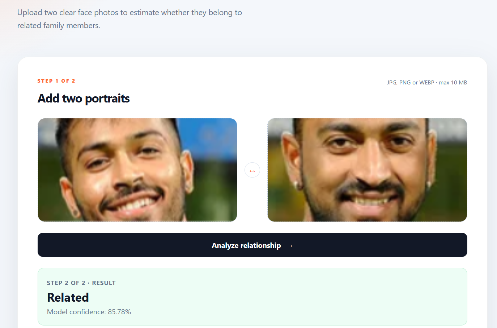

# 👨‍👩‍👧 Kinship Verification using Siamese Neural Network

A Deep Learning project that predicts whether two face images belong to biological family members using a **Siamese Neural Network** built with **PyTorch** and deployed as a **FastAPI web application** with a modern HTML, CSS, and JavaScript frontend.

---

# 🌐 Live Demo

🚀 **Web Application**
Upload two portrait images and the application predicts whether the individuals are biologically related along with a confidence score.

Example:

✅ Related

❌ Not Related

https://kinship-verification.onrender.com/

> **Best Results**
>
> The model is designed for **two different individuals** and performs best on clear, frontal portrait images with visible facial features.

> The first request may take around 30–60 seconds because the application is hosted on Render's free tier.

## 📌 Overview

Kinship Verification is a binary image similarity problem where a model determines whether two face images belong to related family members.

This project explores multiple Siamese Network training strategies and provides an end-to-end web application for real-time inference.

> **Note**
>
> For detailed information about the dataset, problem statement, preprocessing, model architecture, training pipeline, and implementation details, please refer to **GUIDE.md**.

---

## 🎯 Motivation

Kinship verification has applications in:

- Human trafficking investigations
- Missing children identification
- Family photo organization
- Face retrieval systems
- Academic computer vision research
- Social media image analysis
---

# 🎯 Intended Use

This project focuses on **kinship verification**, where the objective is to determine whether **two different individuals share inherited facial characteristics** that suggest a biological relationship.

Unlike face recognition, which answers:

> "Are these two images of the same person?"

Kinship verification answers:

> **"Do these two different people share inherited facial traits?"**

The deployed model predicts whether two face images are likely to belong to biological family members based on learned facial feature similarities.


## ✨ Features

- Siamese Neural Network with shared ResNet18 backbone
- Binary kinship verification
- Real-time image pair inference
- Automatic model download from Hugging Face
- Responsive deployment on Render

---

---

## 📂 Dataset

This project was trained using the **Recognizing Families In the Wild (RFIW)** dataset, derived from the **Families In The Wild (FIW)** benchmark, one of the largest publicly available datasets for kinship verification research.

### Dataset Statistics

| Statistic | Value |
|-----------|------:|
| Families | 470 |
| Individuals | 2,318 |
| Face Images | 12,379 |
| Positive Image Pairs | 165,179 |
| Negative Image Pairs | 165,179 |
| Total Training Pairs | 330,358 |

Positive and negative image pairs were generated from family relationships to train the Siamese Neural Network for binary kinship verification.

## 🛠 Technology Stack

### Deep Learning

- PyTorch
- Torchvision
- NumPy
- Pillow (PIL)

### Backend

- FastAPI
- Uvicorn

### Frontend

- HTML5
- CSS3
- Vanilla JavaScript

### Dataset

- Kaggle Kinship Recognition Dataset

---

## 📂 Project Structure

```text
Kinship-Verification-Siamese-Network/
│
├── backend/
│   ├── app.py
│   ├── model.py
│   ├── predict.py
│   └── utils.py
│
├── static/
│   ├── index.html
│   ├── styles.css
│   └── app.js
│
├── assets/
│   ├── homepage.png
│   ├── prediction-related.png
│   └── prediction-not-related.png
│
├── 01_train_baseline.ipynb
├── 02_train_faces.ipynb
├── 03_combined_training.ipynb
│
├── checkpoints_baseline/
├── checkpoints_train_faces/
├── checkpoints_combined/
│
├── GUIDE.md
├── DEPLOYMENT.md
├── render.yaml
├── requirements.txt
├── README.md
└── .gitignore
```

---

# 🚀 Installation

Clone the repository

```bash
git clone https://github.com/princeVerma73/Kinship-Verification-Siamese-Network.git
```

Move inside the project

```bash
cd Kinship-Verification-Siamese-Network
```

Create virtual environment

```bash
python -m venv .venv
```

Activate

### Windows

```bash
.venv\Scripts\activate
```

### Linux / macOS

```bash
source .venv/bin/activate
```

Install dependencies

```bash
pip install -r requirements.txt
```

---

# ▶️ Run the Application

Start the FastAPI server

```bash
uvicorn backend.app:app --reload
```

Open your browser

```
http://localhost:8000
```

---

# 🧠 Model Workflow

```text
Face Image 1
        │
        ▼
    ResNet18
        │
 Face Embedding
        │
        │
Face Image 2
        │
        ▼
    ResNet18
        │
 Face Embedding
        │
        ▼
Embedding Comparison
        │
        ▼
Related / Not Related
```

---

# 📷 Application Preview

## Homepage


---

## Prediction — Related



---

## Prediction — Not Related


---

# 📊 Training Experiments

| Notebook | Description |
|----------|-------------|
| 01_train_baseline.ipynb | Baseline Siamese Network training |
| 02_train_faces.ipynb | Training using cropped face dataset |
| 03_combined_training.ipynb | Combined training strategy |

---

# 🔬 Model Comparison

Three different Siamese Network models were developed and evaluated during this project.

| Model | Description |
|--------|-------------|
| Baseline Model | Standard Siamese Network using ResNet18 |
| Train-Faces Model | Trained using cropped face images |
| Combined Training Model | Combined training strategy |

The **Train-Faces** model achieved good quantitative results during experimentation but produced inconsistent predictions on several real-world family image pairs.

After comparing both validation metrics and qualitative predictions on unseen images, the **Baseline Model** demonstrated more reliable and consistent performance. Therefore, the deployed web application uses the **Baseline Model** for inference.

---

## 📈 Model Performance

The deployed Baseline Model achieved the following validation metrics:

| Metric | Score |
|--------|-------:|
| Accuracy | 96.07% |
| Precision | 97.10% |
| Recall | 94.95% |
| F1 Score | 96.01% |
| ROC-AUC | 99.35% |

# ⚠️ Limitations

- Designed for **kinship verification**, not face recognition.
- Works best with clear frontal portrait images.
- Prediction quality may decrease for:
  - large age differences
  - heavy occlusions
  - poor lighting
  - extreme poses
  - low-resolution images
- Performance may vary on internet images that differ from the training distribution.
- Predictions should be interpreted as similarity estimates rather than definitive proof of biological relationships.
- This project is intended for research and educational purposes only.

---

# 📦 Repository Notes

- Training datasets are not included because of their large size.
- Model checkpoint files are excluded from GitHub.
- All training notebooks are included for reproducibility.
- Refer to **GUIDE.md** for dataset preparation, preprocessing, training pipeline, and implementation details.

---

# ⚠️ Challenges

Kinship verification is significantly harder than face recognition because:

- Family members can have large appearance differences.
- Age gaps introduce major facial changes.
- Lighting and pose variations affect similarity.
- Accessories like glasses or facial hair can mislead the model.
- Different generations often have weak visual resemblance.

---

# 🚀 Future Improvements

- Face detection before inference
- Face alignment
- Multi-kinship relationship prediction
- Mobile-friendly interface
- ONNX / TensorRT optimization

---

# 👨‍💻 Author

**Prince Verma**

B.Tech CSE • IIIT Bhagalpur

🔗 GitHub: https://github.com/princeVerma73

💼 LinkedIn: https://www.linkedin.com/in/prince-verma73/

🐦 X (Twitter): https://x.com/Prince_v73

---
# 📄 License

This project is released for educational and research purposes.

# ⭐ Support

If you found this project useful, consider giving the repository a ⭐ on GitHub.

It helps others discover the project and motivates future improvements.
